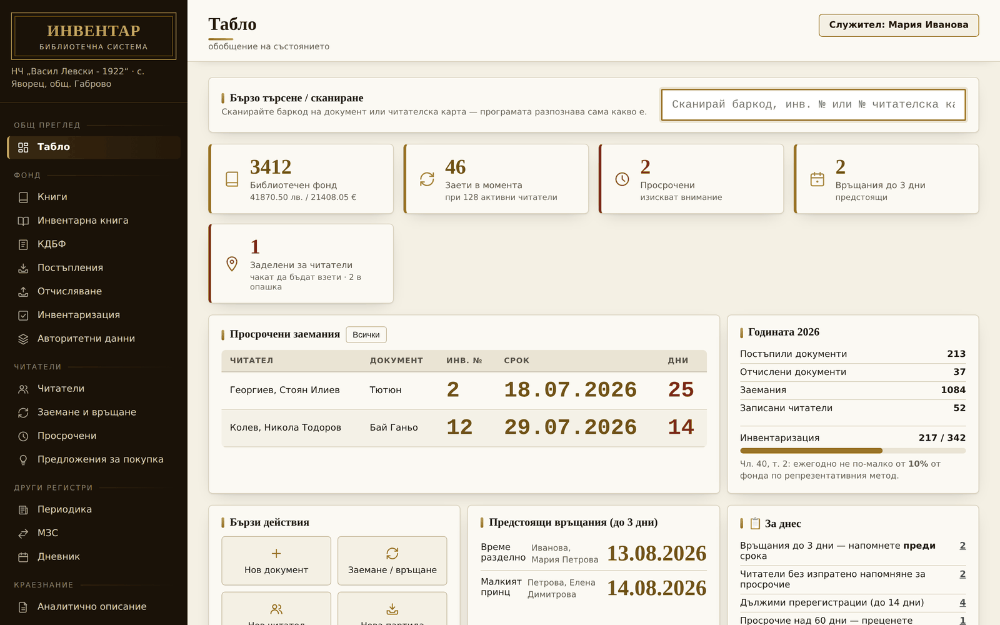
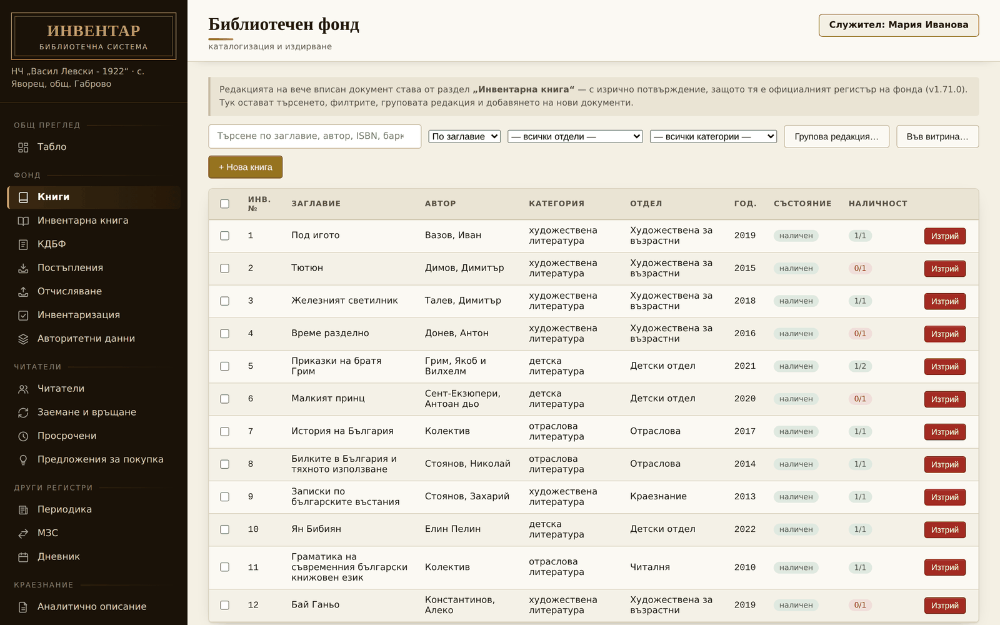
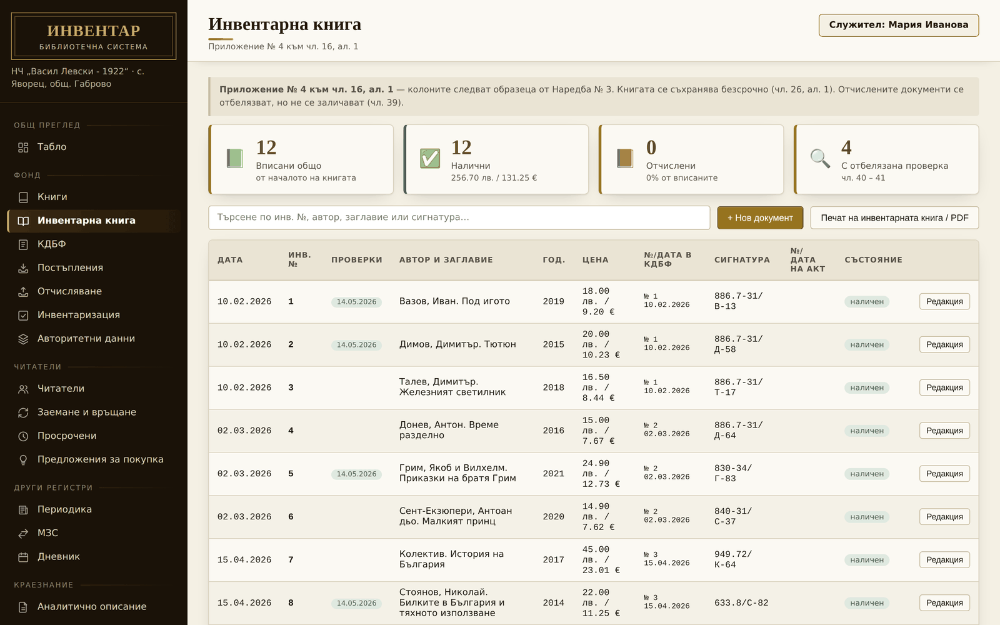
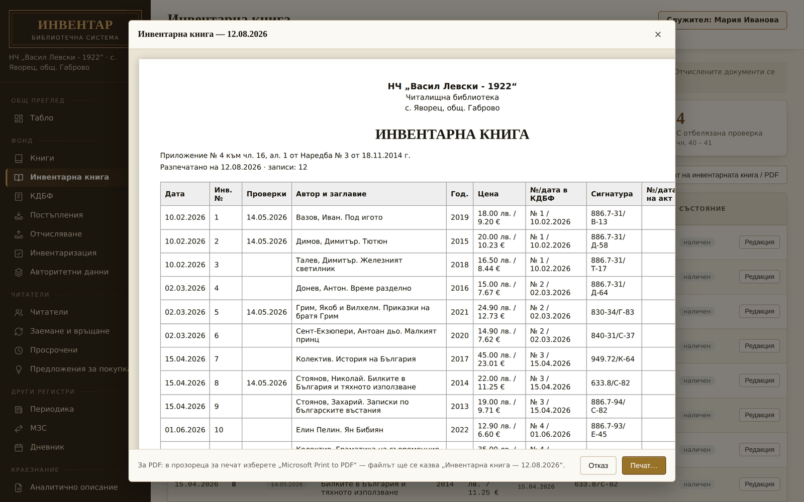
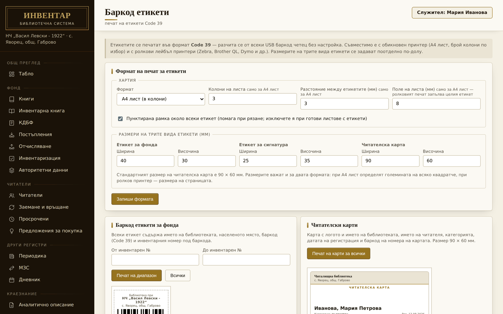
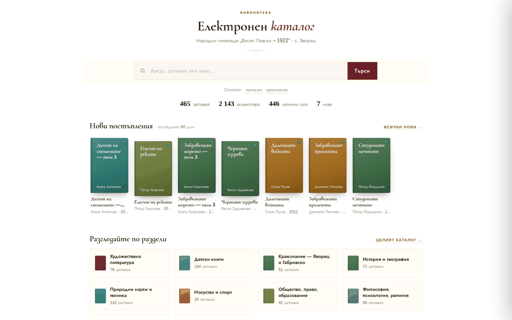

# InvLib — библиотечна система за читалищни, общински и училищни библиотеки

[](https://github.com/plam4o4o-source/yavorec-katalog/actions/workflows/ci.yml)
[](https://github.com/plam4o4o-source/yavorec-katalog/releases)
[](LICENSE)
[](https://invlib.com/)

> **English summary.** *InvLib* is a free, open-source library management
> system (ILS) for small public, community, and school libraries in Bulgaria
> — particularly the *chitalishte* (community culture center) libraries. It is
> an offline-first Windows desktop application (Electron + SQLite) covering
> the full workflow required by the Bulgarian library regulation *Наредба № 3
> от 18.11.2014 г.*: accession/inventory books, cataloging with UDC and
> authority control, reader records and circulation, barcode labels and
> reader cards (Code 39), overdue notices, annual statistics, deaccession
> acts, stocktaking, MARC exports (UNIMARC/MARCXML, Dublin Core), automatic
> backups, and a self-hosted public online catalog published via GitHub.
> The interface is in Bulgarian, since the regulatory domain it implements
> is Bulgarian. Development happens in the open in this repository: every
> release is built from tagged source by GitHub Actions, tested by CI (530+
> tests), and documented in a bilingual [CHANGELOG](electron-app/CHANGELOG.md).

„InvLib“ е **безплатна програма с отворен код** за управление на фонда на
малка читалищна, общинска или училищна библиотека — инвентарна книга, каталог,
читатели и заемане, КДБФ, дневник, отчисляване, инвентаризация и още, по
образеца на **Наредба № 3 от 18.11.2014 г.** Работи **офлайн**, на Windows,
без месечен абонамент и без изпращане на данни където и да е.

Това хранилище съдържа и публичния онлайн каталог
([пример на chyavorec.org](https://chyavorec.org)), захранван от
`katalog.json`, който самата програма публикува тук при всяка промяна.

Уебсайт на самата програма: **[invlib.com](https://invlib.com/)**.

## Снимки на екрана (Screenshots)

| | |
|---|---|
|  |  |
| Табло — състоянието на библиотеката с един поглед | Библиотечен фонд — търсене, филтри, групова редакция |
|  |  |
| Инвентарна книга по Приложение № 4 към чл. 16, ал. 1 | Преглед преди печат — всеки документ първо на екрана |
|  |  |
| Баркод етикети (Code 39) и читателски карти | Публичният онлайн каталог на сайта на библиотеката |

*Снимките показват реалния интерфейс, зареден с примерни данни.*

## Основни възможности

- **Инвентарна книга и КДБФ** по образците от Наредба № 3, с печат и PDF
- **Каталогизация** — УДК класификация, авторитетен контрол на автори и
  заглавия, авторски знак, въвеждане на записи по ISBN (Google Books / SRU)
- **Читатели и заемане** — читателски карти, срокове и продължения по
  категория, календар на затворените дни, наказания и обезщетения,
  напомнителни писма, читателска сметка с квитанции
- **Баркоди** — етикети за фонда, етикети за сигнатура и читателски карти
  (Code 39), печат на A4 или ролков лейбъл принтер; работа с USB баркод
  четец, включително защита срещу сгрешена клавиатурна подредба (кирилица)
- **Преглед преди печат** на всички ~14 печатни документа
- **Отчисляване** с актове по чл. 30 – 39 и **инвентаризация** по чл. 40 – 41
  (включително мобилно сканиране с телефон)
- **Дневник на библиотеката** (Раздел А/Б) и годишни справки
- **Краезнание** — аналитично описание на статии, летопис, персоналии
- **Периодика, МЗС (междубиблиотечно заемане), витрини, предложения за покупка**
- **Онлайн каталог** — програмата публикува `katalog.json` в GitHub
  хранилище, а страница на сайта на библиотеката го чете на живо (без
  сървър, без абонамент); никакви лични данни на читатели не се публикуват
- **Извеждане** — UNIMARC/MARCXML, Dublin Core, CSV; **въвеждане** от друга система
- **Защита на данните** — локална SQLite база, шифроване на ЕГН/№ ЛК с
  парола, анонимизиране на стари заемания, одитна следа по служител,
  автоматични резервни копия
- **Работа в локална мрежа** — споделена база данни за няколко компютъра
- **Автоматично обновяване** от GitHub Releases

## За кого е предназначена

Читалищни библиотеки, малки общински и селски библиотеки, училищни и
специализирани сбирки, културни институции — всяка малка българска
библиотека, която води инвентарна книга по Наредба № 3 и няма бюджет за
скъпа интегрирана система. Програмата е **универсална**: името на
библиотеката, населеното място, комисията и всички реквизити се въвеждат
веднъж в „Настройки“ — в кода няма нищо, вписано за конкретна библиотека.

## Инсталиране (за библиотекари)

1. Изтеглете последния `InvLib-Setup-X.Y.Z.exe` от
   [GitHub Releases](https://github.com/plam4o4o-source/yavorec-katalog/releases).
2. Стартирайте инсталатора и следвайте стъпките (на български).
3. При първо стартиране програмата отваря „Настройки“ — попълнете данните
   на библиотеката.

Подробният наръчник е в
[`docs/narachnik-za-bibliotekarya.pdf`](docs/narachnik-za-bibliotekarya.pdf),
а описание на всеки раздел — в
[`electron-app/README-bibliotekar.md`](electron-app/README-bibliotekar.md).
Инсталаторът засега е без цифров подпис — ако Windows SmartScreen или
антивирусна програма предупреди, вижте
[какво означава това и какво се прави](electron-app/README-bibliotekar.md#цифров-подпис-и-антивирусни-програми).

### Изисквания

- Windows 10 или 11, 64-bit
- няколкостотин МБ място на диска; базата данни расте с фонда (SQLite файл)
- Интернет е нужен само за: автоматично обновяване, търсене по ISBN и
  публикуване на онлайн каталога — всичко останало работи изцяло офлайн

## Разработка (за програмисти)

```bash
git clone https://github.com/plam4o4o-source/yavorec-katalog.git
cd yavorec-katalog/electron-app
npm install        # включва electron-rebuild за better-sqlite3
npm start          # стартира програмата в режим за разработка
npm test           # node:test — всички тестове (530+)
```

Изисквания за разработка: Node.js 22+, npm. За build на Windows
инсталатора: `npm run build` (electron-builder; официалните издания се
строят от GitHub Actions при push на таг `vX.Y.Z`).

## Документация

| Документ | Съдържание |
|---|---|
| [`electron-app/README.md`](electron-app/README.md) | техническа документация: структура, build, схема на БД, IPC, версии |
| [`electron-app/README-bibliotekar.md`](electron-app/README-bibliotekar.md) | за библиотекаря: настройки, раздели, цифров подпис/антивирусни |
| [`docs/ARCHITECTURE.md`](docs/ARCHITECTURE.md) | архитектурни решения и извлечени уроци, версия по версия |
| [`docs/naredba-3-karta.md`](docs/naredba-3-karta.md) | кой член от Наредба № 3 коя функция изпълнява |
| [`docs/narachnik-za-bibliotekarya.pdf`](docs/narachnik-za-bibliotekarya.pdf) | наръчник за ежедневната работа |
| [`electron-app/CHANGELOG.md`](electron-app/CHANGELOG.md) | всички издания, двуезично (BG/EN) |

## Принос (Contributing)

Приемат се доклади за грешки, предложения и pull request-и — вижте
[`CONTRIBUTING.md`](CONTRIBUTING.md) за стила на кода, изискванията към
тестовете и процеса. Докладвайте грешки през
[Issues](https://github.com/plam4o4o-source/yavorec-katalog/issues).

## Сигурност

За уязвимости вижте [`SECURITY.md`](SECURITY.md) — предпочитаният канал е
GitHub Security Advisories (частен доклад), не публичен issue.

## Лиценз

[GNU General Public License v3.0 or later](LICENSE) (GPL-3.0-or-later).
Български неофициален превод за улеснение: [`LICENSE.bg.md`](LICENSE.bg.md)
(меродавен е английският текст в `LICENSE`).

## Пътна карта (Roadmap)

- **Цифров подпис на инсталатора** — премахва предупрежденията на
  SmartScreen и антивирусните програми; проучени са SignPath Foundation
  (повторна кандидатура при натрупана публична видимост), Azure Trusted
  Signing и Certum Open Source ([подробности](electron-app/README-bibliotekar.md#цифров-подпис-и-антивирусни-програми))
- **Обратна връзка от още библиотеки** — програмата е универсална по
  замисъл; целта е да бъде изпробвана и от други читалищни/общински/училищни
  библиотеки и развивана по реалните им нужди
- Подобрения, предлагани от практиката, се вписват и обсъждат в
  [Issues](https://github.com/plam4o4o-source/yavorec-katalog/issues);
  идеи се сверяват и с утвърдени системи като Koha (виж
  [`docs/ARCHITECTURE.md`](docs/ARCHITECTURE.md), раздел „Koha като
  източник на идеи“)

## Статус на проекта

**В активна разработка и в реална ежедневна употреба** в библиотеката на
НЧ „Васил Левски – 1922“, с. Яворец (общ. Габрово), чийто публичен каталог
се захранва от това хранилище. Изданията са редовни (виж
[Releases](https://github.com/plam4o4o-source/yavorec-katalog/releases)),
всяко с описание в CHANGELOG и пълен тестов пакет.

## Автор

Пламен Христов - Пачо.
